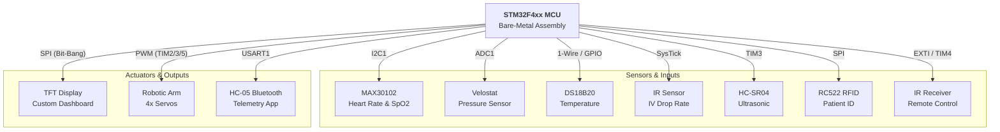

<div align="center">
  
  
  # 🏥 Smart Nurse Robot
  **Advanced Bare-Metal ARM Assembly Project**
  
  
  
  
  
  
</div>

<br/>

> **A comprehensive, fully autonomous medical assistant robot designed to navigate hospital corridors, monitor patient vital signs, and deliver medical supplies. This project is built entirely from scratch using Bare-Metal ARM Assembly (No HAL, No external C libraries), demonstrating advanced register-level manipulation of the STM32 microcontroller.**

---

## 🏗️ System Architecture

To understand the complexity of the project, here is a high-level block diagram of how the STM32 interacts with all peripherals entirely via Bare-Metal Assembly:



---

## ✨ Key Innovations & Features

* 💧 **Precision IV Drop Rate Monitor (In-House Design):** A custom-built optical tracking system using IR sensors and SysTick interrupts to calculate real-time IV fluid drop rates (drops/min) with automated **HIGH/LOW/OK** threshold alerts.
* 🧠 **Neural Pressure & Stress Sensing:** Integrates a Velostat piezoresistive sensor via ADC to measure patient nerve pressure and stress levels, adding a psychological monitoring dimension to standard biometrics.
* 🤖 **Autonomous Hospital Navigation:** Features a "Robot Mode" that uses HC-SR04 ultrasonic sensors for corridor navigation. The robot autonomously halts at specific room distances and triggers a synchronized robotic arm sequence (via multi-channel PWM) to deliver items.
* 🩸 **Real-Time Vitals DSP:** Interfaces with the MAX30102 via custom I2C drivers. Includes an assembly-level **Digital Signal Processing (DSP)** algorithm to parse raw Red/IR FIFO buffers into accurate Heart Rate (BPM) and Blood Oxygen (SpO2) values.
* 🪪 **Patient Identification System:** Uses an RC522 RFID reader over SPI to authenticate patients. Scanning a tag dynamically loads the patient's local medical profile (Name, Age, Condition) onto the dashboard.
* 🖥️ **Custom TFT Smart Dashboard:** An entirely custom SPI display driver featuring a multi-state UI menu system, dynamic history rendering, and real-time vital sign tracking.

---

## 📱 Wireless Telemetry & App Integration

The robot is not just a standalone device; it acts as an IoT node communicating with remote nursing stations.

<div align="center">
  
  <p><i>Live Mobile Telemetry App developed specifically for this project.</i></p>
</div>

* **Local Control:** IR Remote decoder using EXTI for dashboard navigation.
* **Wireless Telemetry:** Live telemetry transmitted via HC-05 over USART. By sending a hex command (`0x9A`), the mobile app requests a full buffer dump of all current patient vitals.

---

## 🧰 Hardware & Internal Wiring

<div align="center">
  
  <p><i>Internal Hardware & Complex Wiring managed by the team.</i></p>
</div>

| Peripheral / Sensor | Protocol / Interface | STM32 Hardware Block Used | Purpose |
| :--- | :--- | :--- | :--- |
| **TFT Display** | SPI (Custom Bit-bang) | GPIO, Timers | UI Dashboard & Menu System |
| **MAX30102** | I2C | I2C1 | Heart Rate & SpO2 Monitoring |
| **DS18B20** | 1-Wire | GPIO (Delay-based) | Ambient / Room Temperature |
| **RC522 RFID** | SPI | SPI / GPIO | Patient Identification |
| **HC-SR04** | Trigger/Echo | TIM3 (Input Capture) | Obstacle Avoidance |
| **Velostat** | Analog | ADC1 | Touch Pressure Sensing |
| **IR Drop Sensor** | Digital Interrupt | SysTick, GPIO | IV Drop Rate Tracking |
| **IR Receiver** | EXTI | EXTI, TIM4 | Remote Control Decoding |
| **HC-05 Bluetooth**| UART | USART1 | Wireless Data Transmission |
| **Robotic Arm** | PWM | TIM2, TIM3, TIM5 | Delivery Sequence |

---

## 📁 Source Code Structure

The entire codebase is structured in modular Assembly files, separating drivers from application logic:

```text
📦 Nurse-Robot
 ┣ 📜 main.s         # Main State Machine, UI rendering, & System Init
 ┣ 📜 max.s          # MAX30102 I2C driver & DSP (Heart Rate/SpO2)
 ┣ 📜 RFID.s         # RC522 SPI driver & Patient Authentication
 ┣ 📜 Robot_mode.s   # Autonomous navigation logic & Obstacle avoidance
 ┣ 📜 arm.s          # Servo & Robotic Arm PWM control sequences
 ┣ 📜 bluetooth.s    # HC-05 USART Telemetry & Data parsing
 ┣ 📜 DROP rate.s    # IV Drop rate calculation via SysTick
 ┣ 📜 IR.s           # IR Remote decoding via EXTI and Timers
 ┣ 📜 temperature.s  # DS18B20 1-Wire protocol implementation
 ┣ 📜 TFT.s          # Custom SPI Display driver & 8x8 Fonts mapping
 ┣ 📜 ultrasonic.s   # HC-SR04 distance measurement
 ┗ 📜 velostat.s     # ADC configuration for pressure sensing
```

---

## 💡 Code Showcase: Bare-Metal Power

Writing DSP algorithms and hardware drivers in Assembly requires immense precision. Here is a small glimpse of how we handle I2C Reads natively without any libraries:

```assembly
I2C_Read_ACK
    PUSH {R1, R2, LR}
    LDR R1, =I2C1_CR1
    LDR R2, [R1]
    ORR R2, R2, #(1 :SHL: 10)   ; Enable ACK bit
    STR R2, [R1]
    LDR R1, =I2C1_SR1
wait_rxne_ack
    LDR R2, [R1]
    TST R2, #(1 :SHL: 6)        ; Wait for RXNE (Receive Data Register Not Empty)
    BEQ wait_rxne_ack
    LDR R1, =I2C1_DR
    LDR R0, [R1]                ; Read byte from Data Register
    AND R0, R0, #0xFF           
    POP {R1, R2, PC}
```

---

## 🚀 Getting Started

<details>
<summary><b>Click to expand Installation & Build Instructions</b></summary>

### Prerequisites
* **IDE:** Keil uVision 5 (or any ARM cross-compiler configured for pure assembly).
* **Hardware:** STM32F4xx series Discovery/Nucleo board, ST-Link V2 Programmer.

### Build & Flash
1. Clone this repository to your local machine.
2. Open the project file (`.uvprojx`) in Keil uVision.
3. Verify the Target Options (ensure the correct STM32 MCU is selected).
4. Build the target (`F7`). Ensure there are **0 Errors**.
5. Connect the ST-Link and click **Download** (`F8`) to flash the firmware to the MCU.
</details>

---

## 🕹️ Operating Guide

### 1. Stationary Monitor Mode (Dashboard)
* Upon boot, the system initializes the TFT display with the **Smart Control Dashboard**.
* Use the **IR Remote** (`UP`, `DOWN`, `OK`, `LEFT`) to navigate between:
    * Room Temp / Body Temp Logs
    * Heart Rate & SpO2 Analytics
    * Velostat Pressure Gauge
    * IV Drop Rate Target Configuration

### 2. Autonomous Robot Mode
* Press button `[1]` on the IR remote to transition to Robot Mode.
* The robot will automatically drive forward, utilizing the ultrasonic sensor to scan the corridor.
* **Logic Triggers:**
    * `Distance > 170cm`: Move Forward.
    * `Distance 85-100cm` OR `155-170cm`: Room Detected. Engage Brakes ➔ Execute Robotic Arm Delivery Sequence ➔ Resume.
    * `Distance < 30cm`: Emergency Brake.

---

## 📌 Workload Distribution

> *This project was accomplished through the hard work of the entire team. We all contributed to every part of the project — brainstorming, developing, and staying up late together. The following distribution represents the primary contributions of each team member.*

<details>
<summary><b>View Team Contributions</b></summary>

### 🛠️ Mechanical Design & Structure
- **Fady Fawzy, Ayman Alaa** — Design and implementation of the physical robot structure

### 💻 Software & System Integration
- **Omar Youssef & Fady Ashraf** — Main loop, code integration, and Sensor History
- **Fady Fawzy, Omar Youssef & Fady Ashraf** — Screen and menu system

### 🌡️ Sensors & Hardware Modules
- **Fady Ashraf** — Temperature sensor  
- **Kirellous Kamel, Kirellous Sameh, Ayman Alaa, Jody Ali, Mohammed Ahmed** — MAX module  
- **Kirellous Kamel & Jody Ali** — Velostat  
- **Omar Youssef** — IR remote  
- **Kirellous Kamel & Ayman Alaa** — Bluetooth module  
- **Yousuf Safwat, Eissa Ali & Kirellous Sameh** — RFID system

### 🤖 Control & Logic
- **Yousuf Safwat & Mohammad Ahmed** — ARM control  
- **Kirellous Kamel & Fady Ashraf** — Item distribution logic  
- **Eissa Hozayen & Yousuf Safwat** — Motion system  
- **Kirellous Kamel, Fady Ashraf, Omar Youssef & Fady Fawzy** — Drop rate system

### 📱 Application Development
- **Fady Fawzy & Jody Ali** — Mobile application

</details>

---

<div align="center">
  <h2>👨‍💻 Developed by: MED-E</h2>
  <p><i>Computer Engineering | Cairo University<br/>Microprocessors & Embedded Systems Project</i></p>
</div>

### 📧 Team Contacts
- fady.fawzy2006@gmail.com
- fadyashraf255200@gmail.com  
- eissahozayen123@gmail.com  
- Jody.Ali06@eng-st.cu.edu.eg  
- kokokamel130@gmail.com  
- sameh.wagih331@gmail.com  
- yousuf.gabr06@eng-st.cu.edu.eg  
- ayman.taher05@eng-st.cu.edu.eg  
- omaryoussefsaid12@gmail.com  
- mohamed.ahmed0411@eng-st.cu.edu.eg
