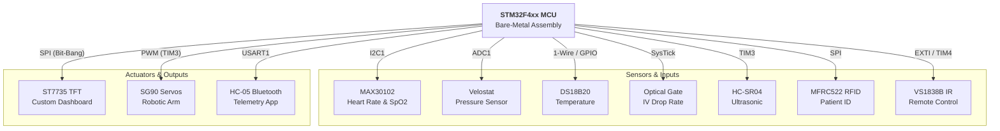
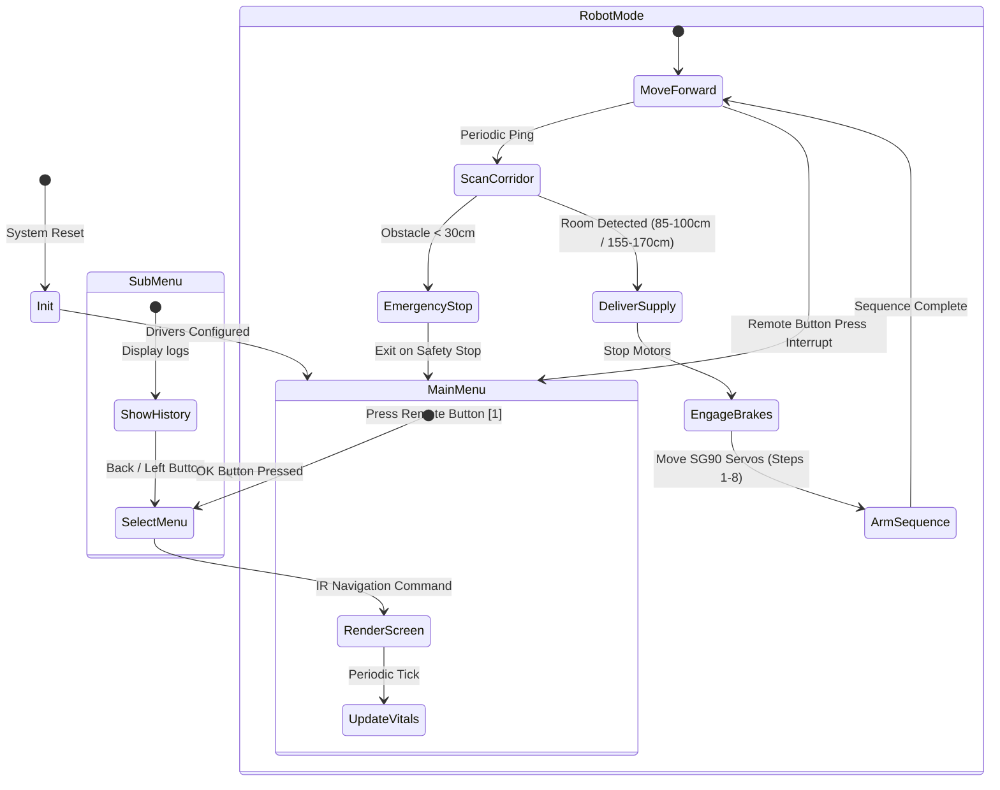

<div align="center">
  
  
  # 🏥 Smart Nurse Robot
  **Advanced Bare-Metal ARM Assembly Project**
  
  
  
  
  
  
</div>

<br/>

> **A comprehensive, fully autonomous medical assistant robot designed to navigate hospital corridors, monitor patient vital signs, and deliver medical supplies. This project is built entirely from scratch using Bare-Metal ARM Assembly (No HAL, No external C libraries), demonstrating advanced register-level manipulation of the STM32 microcontroller.**

---

## 🏗️ System Architecture

To understand the complexity of the project, here is a high-level block diagram of how the STM32 interacts with all peripherals entirely via Bare-Metal Assembly:



---

## 🔌 Hardware Port Map & Registers

The system orchestrates a wide array of specialized electronic modules through direct memory-mapped register configuration. Below is the detailed wiring and pinout scheme:

| Peripheral Module | STM32 Pin | GPIO Mode | Register Settings (AHB1/APB1/APB2) | Description |
| :--- | :--- | :--- | :--- | :--- |
| **ST7735 TFT Display** | **PA9** (SCK)<br/>**PA10** (MOSI) | Output (High Speed) | `GPIOA_MODER` = Alternate Output (01)<br/>`GPIOA_OSPEEDR` = High Speed (11) | Bit-banged SPI Clock and Data lines for UI rendering. |
| | **PB12** (CS)<br/>**PB13** (RST)<br/>**PB15** (D/C) | Output (High Speed) | `GPIOB_MODER` = General Output (01)<br/>`GPIOB_OSPEEDR` = High Speed (11) | Display control lines (CS: Active Low, D/C: Low=Cmd / High=Data). |
| **MAX30102 Oximeter** | **PB8** (SCL)<br/>**PB9** (SDA) | Alternate Function | `GPIOB_MODER` = AF Mode (10)<br/>`GPIOB_OTYPER` = Open-Drain (1)<br/>`GPIOB_AFRH` = AF4 (I2C1)<br/>`I2C1_CCR` = 80 (100kHz)<br/>`I2C1_TRISE` = 17 | I2C1 serial interface with external pull-ups for vitals tracking. |
| **DS18B20 Temp Sensor**| **PA11** (DQ) | Output (Open-Drain) | `GPIOA_MODER` = Output (01)<br/>`GPIOA_OTYPER` = Open-Drain (1)<br/>`GPIOA_PUPDR` = No Pull | 1-Wire bidirection line. Uses software delays for timings. |
| **MFRC522 RFID Reader** | **PA8** (CS)<br/>**PA9** (SCK)<br/>**PA10** (MOSI) | Output | `GPIOA_MODER` = Output (01) | Bit-banged SPI Master for card reading. |
| | **PB14** (MISO) | Input | `GPIOB_MODER` = Input (00) | SPI Slave-Out line. |
| **HC-SR04 Ultrasonic** | **PB10** (Trigger) | Output | `GPIOB_MODER` = Output (01) | Generates a 10us start ping. |
| | **PB2** (Echo) | Input | `GPIOB_MODER` = Input (00) | Timer-polled pulse width measurement. |
| **Velostat Sensor** | **PA0** (Analog) | Analog Input | `GPIOA_MODER` = Analog (11)<br/>`ADC1_SQR3` = Channel 0<br/>`ADC1_CR2` = ADON (1) | ADC1 conversion to measure relative nerve/touch pressure. |
| **Custom IV Drop Gate** | **PA12** (IR LED) | Output | `GPIOA_MODER` = Output (01) | Powers the IR emitter LED. |
| | **PB3** (IR Recv) | Input | `GPIOB_MODER` = Input (00) | Detects passing drops (falls to LOW). |
| | **PB4** (Indicator) | Output | `GPIOB_MODER` = Output (01) | Visual/Audible indicator (LED/Buzzer) toggles on drop. |
| **VS1838B IR Receiver** | **PB5** (IR Data) | Input (EXTI5) | `SYSCFG_EXTICR2` = Port B<br/>`EXTI_IMR` = Unmasked (1)<br/>`EXTI_FTSR` = Falling Edge (1)<br/>`NVIC_ISER0` = Position 23 (EXTI9_5) | Captures NEC remote control pulses using TIM4. |
| **HC-05 Bluetooth** | **PB6** (TX)<br/>**PB7** (RX) | Alternate Function | `GPIOB_MODER` = AF Mode (10)<br/>`GPIOB_AFRL` = AF7 (USART1)<br/>`USART1_BRR` = `0x0683` (9600 Baud @ 16MHz)<br/>`USART1_CR1` = UE/TE/RE (1) | Wireless data transmission. |
| **SG90 Servos (Arm)** | **PA6** (CH1)<br/>**PA7** (CH2)<br/>**PB0** (CH3)<br/>**PB1** (CH4) | Alternate Function | `GPIOA_MODER`/`GPIOB_MODER` = AF Mode (10)<br/>`GPIO_AFRL` = AF2 (TIM3)<br/>`TIM3_PSC` = 15 (1MHz clock)<br/>`TIM3_ARR` = 19999 (20ms/50Hz)<br/>`TIM3_CCMR1/2` = PWM Mode 1 | Four-channel PWM signals to control gripper and joints. |

---

## 🧠 Software Flow & State Machine

The firmware runs a main loop that coordinates dashboard interactions, telemetry polling, and navigation transitions. The following flowchart explains this execution logic:



---

## 🔬 Core Peripheral Implementations & Timing

Because this is a bare-metal assembly codebase, every protocol transaction is governed by precise register adjustments and fine-tuned delay loops.

### 1. MAX30102 DSP & Vitals Tracking
The MAX30102 oximeter is polled over I2C1 (PB8/PB9). The algorithm extracts raw samples from the sensor's internal 32-sample FIFO:
* **Finger Detection:** If the raw IR sensor value exceeds `WAKE_THRESHOLD` (20,000), the sensor is brought to high power to process data. If it falls below `SLEEP_THRESHOLD` (25,000), it halts processing.
* **Peak Detection:** The assembly code tracks local maxima and minima within a sliding sample window to spot the pulse wave peak.
* **Heart Rate & SpO2 DSP:** Pulse intervals are scaled into Beats Per Minute (BPM). The ratio of AC to DC components for both Red and Infrared light is computed to determine Blood Oxygen Saturation (SpO2) via:
  $$R = \frac{(AC_{red} / DC_{red})}{(AC_{ir} / DC_{ir})}$$
  $$\text{SpO2} = 104 - 17 \times R$$

### 2. DS18B20 1-Wire Timing Logic
The 1-Wire interface is highly timing-sensitive. The STM32 communicates on PA11 by pulling the bus low and releasing it to let the pull-up resistor pull it high. The code uses software delay loops tuned for a 16 MHz CPU clock:
* **Reset Pulse:** Pull line LOW for 480 microseconds, release HIGH, wait 60 microseconds for the presence pulse, then wait 420 microseconds to finish the transaction.
* **Write 0/1 Timeslots:** 
  * *Write '1':* Pull LOW for 2 microseconds, then release HIGH for 60 microseconds.
  * *Write '0':* Pull LOW and hold for 60 microseconds, then release.
* **Read Timeslot:** Pull LOW for 2 microseconds, release, wait 10 microseconds, then sample `GPIOA_IDR` bit 11. Wait 50 microseconds to complete the timeslot.

### 3. Robotic Arm PWM Controller (TIM3)
To generate the 50 Hz PWM control signals for the four SG90/MG996R servo motors:
* Clock prescaler `TIM3_PSC` is set to 15, dividing the 16 MHz clock to 1 MHz (1 tick = 1 microsecond).
* Auto-Reload Register `TIM3_ARR` is loaded with 19,999 to establish a 20,000 microsecond (20 ms) period.
* Output Compare registers `TIM_CCR1` through `TIM_CCR4` control the pulse width (500us for 0°, 1500us for 90°, and 2500us for 180°). The pre-programmed delivery sequence runs through 8 distinct steps, rotating the base joint, extending the arm, opening the gripper, and returning to a resting position.

### 4. Custom IV Drop Tracking System
The optical drop detector uses an IR phototransistor connected to GPIOB Pin 3:
* **Edge Detection:** The code reads the sensor state and checks it against `Prev_State`. A drop is registered only when the state changes from clear (1) to blocked (0). This prevents a single, slow-falling drop from being counted multiple times.
* **Sliding Rate Calculator:** A SysTick timer counts 1-second intervals (using `15,999,999` ticks). Every 10 seconds, the rate of drops per minute is updated by scaling the 10-second count:
  $$\text{Last Rate (drops/min)} = \text{Drops in 10s} \times 6$$
* **Feedback loop:** Whenever the path is blocked (during a drop), Pin B4 resets, turning off the buzzer/LED. When clear, it sets, creating a visual and audible flash/tick.

### 5. VS1838B IR Remote Receiver (NEC Protocol)
The IR remote decoder uses EXTI Line 5 interrupts triggered by PB5:
* **Microsecond Counter:** TIM4 runs as a 1 microsecond timer. Each interrupt reads the counter to measure the gap between falling edges and resets it.
* **NEC Protocol Decoding:** 
  * A gap of 13.5 ms represents the start pulse.
  * A gap of 1.125 ms represents Logic 0.
  * A gap of 2.25 ms represents Logic 1.
* **Verification:** The 32-bit frame `[Address][~Address][Command][~Command]` is verified by checking that `Command + ~Command == 0xFF` before setting the `ir_flag`.

---

## 📁 Source Code Structure

The entire codebase is structured in modular Assembly files, separating hardware drivers from application logic:

| File Name | Purpose | Hardware Interface |
| :--- | :--- | :--- |
| 📜 [main.s](file:///c:/Users/PC/Desktop/Nurse-Robot/main.s) | Main state machine, system clock init, UI rendering, and dashboard loops. | TFT UI Dashboard, System state |
| 📜 [max.s](file:///c:/Users/PC/Desktop/Nurse-Robot/max.s) | MAX30102 configuration, raw I2C buffers reading, and HR/SpO2 calculations. | I2C1 (PB8/PB9) |
| 📜 [RFID.s](file:///c:/Users/PC/Desktop/Nurse-Robot/RFID.s) | SPI Bit-Banged Driver for MFRC522. Handles REQA, anti-collision, and profiles lookup. | Bit-Banged SPI (PA8/PA9/PA10, PB14) |
| 📜 [Robot_mode.s](file:///c:/Users/PC/Desktop/Nurse-Robot/Robot_mode.s) | Autonomous navigation control loop, corridor scanning, and servo sequence calls. | GPIOA ODR (Motors), TIM3 (Servos) |
| 📜 [arm.s](file:///c:/Users/PC/Desktop/Nurse-Robot/arm.s) | TIM3 4-channel 50Hz PWM initialization for the SG90 servos. | TIM3 PWM (PA6/PA7, PB0/PB1) |
| 📜 [bluetooth.s](file:///c:/Users/PC/Desktop/Nurse-Robot/bluetooth.s) | HC-05 USART1 driver. Transmits formatted telemetry sensor data upon receiving request. | USART1 (PB6/PB7) |
| 📜 [DROP rate.s](file:///c:/Users/PC/Desktop/Nurse-Robot/DROP%20rate.s) | IV fluid drop counting, falling edge filtering, and SysTick-based calculation. | GPIOA Pin 12, GPIOB Pin 3 & Pin 4 |
| 📜 [IR.s](file:///c:/Users/PC/Desktop/Nurse-Robot/IR.s) | VS1838B IR Receiver decoding using EXTI Line 5 and TIM4 counters. | EXTI9_5 on PB5, TIM4 |
| 📜 [temperature.s](file:///c:/Users/PC/Desktop/Nurse-Robot/temperature.s) | DS18B20 1-Wire bit-banged timing sequence and temperature scratchpad read. | GPIOA Pin 11 (Open-Drain) |
| 📜 [TFT.s](file:///c:/Users/PC/Desktop/Nurse-Robot/TFT.s) | ST7735 1.8" TFT Bit-Banged SPI driver. Handles window rendering and custom font maps. | Bit-Banged SPI (PA9/PA10, PB12/PB13/PB15) |
| 📜 [ultrasonic.s](file:///c:/Users/PC/Desktop/Nurse-Robot/ultrasonic.s) | HC-SR04 distance measurement. Generates trigger pulse and measures echo length. | GPIOB Pin 10 (Trigger), Pin 2 (Echo) |
| 📜 [velostat.s](file:///c:/Users/PC/Desktop/Nurse-Robot/velostat.s) | ADC1 configuration for channel 0 to sample Velostat analog voltages. | ADC1 on PA0 |

---

## 🛠️ Bare-Metal Assembly Register Showcases

Here is a look at the register-level assembly configuration in this project:

### 1. PWM 50Hz Configuration for Servos (`arm.s`)
This snippet configures TIM3 registers to output PWM on 4 channels for standard servo motors:
```assembly
    ; Enable Clock for TIM3 (APB1 Bus, bit 1)
    LDR R0, =RCC_BASE
    LDR R1, [R0, #RCC_APB1ENR]
    ORR R1, R1, #0x02          
    STR R1, [R0, #RCC_APB1ENR]

    ; Setup TIM3 for 50Hz PWM (16MHz Clock / 16 = 1MHz -> 1 tick = 1us)
    LDR R0, =TIM3_BASE
    LDR R1, =15                ; Prescaler = 15
    STR R1, [R0, #TIM_PSC]
    LDR R1, =19999             ; ARR = 20000 ticks (20ms period)
    STR R1, [R0, #TIM_ARR]
    
    ; Configure Channels 1-4 for PWM Mode 1
    LDR R1, =0x6868           
    STR R1, [R0, #TIM_CCMR1]   ; CH1 and CH2
    LDR R1, =0x6868            
    STR R1, [R0, #TIM_CCMR2]   ; CH3 and CH4
    
    ; Enable outputs for all 4 channels
    LDR R1, =0x1111            
    STR R1, [R0, #TIM_CCER]
```

### 2. ADC1 Setup for Velostat Pressure Sensor (`velostat.s`)
Configuring the ADC to read the analog signal from the Velostat piezoresistive film on PA0:
```assembly
    ; Configure PA0 as Analog Mode (11 in MODER)
    LDR R0, =GPIOA_MODER
    LDR R1, [R0]
    ORR R1, R1, #0x03        ; Set bits 0 and 1
    STR R1, [R0]

    ; Configure ADC1 regular sequence to read channel 0 first
    LDR R0, =ADC1_SQR3
    LDR R1, [R0]
    BIC R1, R1, #0x1F        ; Clear SQ1 bits to select Channel 0
    STR R1, [R0]

    ; Power on the ADC
    LDR R0, =ADC1_CR2
    LDR R1, [R0]
    ORR R1, R1, #0x01        ; Set ADON bit
    STR R1, [R0]
```

---

## 📱 Wireless Telemetry & App Integration

The robot communicates with remote nursing stations.

<div align="center">
  
  <p><i>Live Mobile Telemetry App developed specifically for this project.</i></p>
</div>

* **Local Control:** IR Remote decoder using EXTI for dashboard navigation.
* **Wireless Telemetry:** Live telemetry transmitted via HC-05 over USART. By sending a hex command (`0x9A`), the mobile app requests a full buffer dump of all current patient vitals.

---

## 🕹️ Operating Guide & IR Keymap

### 1. Stationary Monitor Mode (Dashboard)
* Upon boot, the system initializes the TFT display with the **Smart Control Dashboard**.
* Use the **IR Remote** (`UP`, `DOWN`, `OK`, `LEFT`) to navigate between:
    * Room Temp / Body Temp Logs
    * Heart Rate & SpO2 Analytics
    * Velostat Pressure Gauge
    * IV Drop Rate Target Configuration

### 2. Autonomous Robot Mode
* Press button `[1]` on the IR remote to transition to Robot Mode.
* The robot will automatically drive forward, utilizing the ultrasonic sensor to scan the corridor.
* **Logic Triggers:**
    * `Distance > 170cm`: Move Forward.
    * `Distance 85-100cm` OR `155-170cm`: Room Detected. Engage Brakes ➔ Execute Robotic Arm Delivery Sequence ➔ Resume.
    * `Distance < 30cm`: Emergency Brake.

### 3. Patient ID Scanner
* Bring a known patient RFID card close to the MFRC522 reader.
* The screen will clear and pull the matching clinical profile:
  * **Card 1 (`0x031F39CA`):** Name: **SAFWAT** | Age: **19** | Displays real-time SpO2, HR, Pressure, Room Temp.
  * **Card 2 (`0x023338E6`):** Name: **OMAR** | Age: **21** | Displays profile details.

### 4. IR Remote Controller NEC Keymap

| IR Remote Button | NEC Command (Hex) | Action on System |
| :--- | :--- | :--- |
| **UP** | `0x18` | Move selection UP in dashboard |
| **DOWN** | `0x52` | Move selection DOWN in dashboard |
| **LEFT** | `0x08` | Go back to Main Menu |
| **RIGHT** | `0x5A` | Navigate right |
| **OK** | `0x1C` | Confirm Selection / Enter Sub-Menu |
| **1** | `0x45` | Enter Autonomous Robot Mode |
| **0** | `0x19` | Reset / Stop Mode |

---

## 🚀 Getting Started

<details>
<summary><b>Click to expand Installation & Build Instructions</b></summary>

### Prerequisites
* **IDE:** Keil uVision 5 (configured for ARM Assembly).
* **Hardware:** STM32F4xx series Discovery/Nucleo board, ST-Link V2 Programmer.
* **Components:** See the Hardware BOM pin mapping.

### Build & Flash
1. Clone this repository to your local machine.
2. Open the project file (`.uvprojx`) in Keil uVision.
3. Verify the Target Options (ensure the correct STM32 MCU is selected).
4. Build the target (`F7`). Ensure there are **0 Errors**.
5. Connect the ST-Link and click **Download** (`F8`) to flash the firmware to the MCU.
</details>

---

## 📌 Workload Distribution

> *This project was accomplished through the hard work of the entire team. We all contributed to every part of the project — brainstorming, developing, and staying up late together. The following distribution represents the primary contributions of each team member.*

<details>
<summary><b>View Team Contributions</b></summary>

### 🛠️ Mechanical Design & Structure
- **Fady Fawzy, Ayman Alaa** — Design and implementation of the physical robot structure

### 💻 Software & System Integration
- **Omar Youssef & Fady Ashraf** — Main loop, code integration, and Sensor History
- **Fady Fawzy, Omar Youssef & Fady Ashraf** — Screen and menu system

### 🌡️ Sensors & Hardware Modules
- **Fady Ashraf** — Temperature sensor (DS18B20)
- **Kirellous Kamel, Kirellous Sameh, Ayman Alaa, Jody Ali, Mohammed Ahmed** — MAX30102 Oximeter module  
- **Kirellous Kamel & Jody Ali** — Velostat Pressure Sensor  
- **Omar Youssef** — IR Remote & Receiver System
- **Kirellous Kamel & Ayman Alaa** — Bluetooth (HC-05) module  
- **Yousuf Safwat, Eissa Ali & Kirellous Sameh** — RFID (MFRC522) System

### 🤖 Control & Logic
- **Yousuf Safwat & Mohammad Ahmed** — Core ARM logic & Peripheral Control
- **Kirellous Kamel & Fady Ashraf** — Item distribution / Robotic Arm logic
- **Eissa Hozayen & Yousuf Safwat** — Base Motion / Robot Movement system
- **Kirellous Kamel, Fady Ashraf, Omar Youssef & Fady Fawzy** — Custom Drop Rate sensing system

### 📱 Application Development
- **Fady Fawzy & Jody Ali** — Mobile application (Telemetry Interface)

</details>

---

<div align="center">
  <h2>👨‍💻 Developed by: MED-E</h2>
  <p><i>Computer Engineering | Cairo University<br/>Microprocessors & Embedded Systems Project</i></p>
</div>

### 📧 Team Contacts

| Name | Email Address |
| :--- | :--- |
| **Fady Fawzy** | fady.fawzy2006@gmail.com |
| **Fady Ashraf** | fadyashraf255200@gmail.com |
| **Eissa Hozayen** | eissahozayen123@gmail.com |
| **Jody Ali** | Jody.Ali06@eng-st.cu.edu.eg |
| **Kirellous Kamel** | kokokamel130@gmail.com |
| **Kirellous Sameh** | sameh.wagih331@gmail.com |
| **Yousuf Safwat** | yousuf.gabr06@eng-st.cu.edu.eg |
| **Ayman Alaa** | ayman.taher05@eng-st.cu.edu.eg |
| **Omar Youssef** | omaryoussefsaid12@gmail.com |
| **Mohamed Ahmed** | mohamed.ahmed0411@eng-st.cu.edu.eg |
