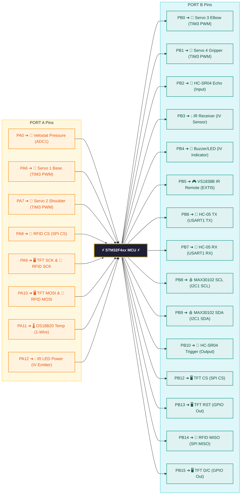
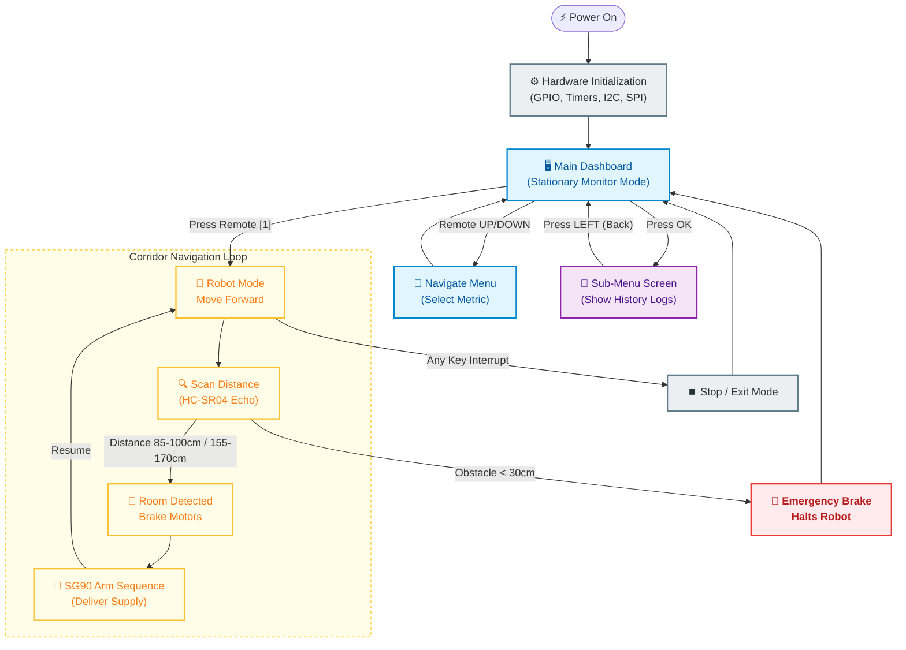

  
  
  # 🏥 Smart Nurse Robot
  **Advanced Bare-Metal ARM Assembly Project**
  
  
  
  
  
  

 

> **A comprehensive, fully autonomous medical assistant robot designed to navigate hospital corridors, monitor patient vital signs, and deliver medical supplies. This project is built entirely from scratch using Bare-Metal ARM Assembly (No HAL, No external C libraries), demonstrating register-level control of the STM32 microcontroller.**

---

## 📌 STM32 Pinout & Peripheral Mapping

Below is the visual map of the STM32 microcontroller, showing exactly which pins (البِنّات) are mapped to which sensors and actuators in the system:

---

## 🔌 Hardware Port Map & Wiring Table

For a quick reference of connections, here is the full hardware mapping table:

| Peripheral Module | STM32 Pin | Interface / Protocol | Purpose |
| :--- | :--- | :--- | :--- |
| **ST7735 TFT Display** | **PA9** (SCK) **PA10** (MOSI) **PB12** (CS) **PB13** (RST) **PB15** (D/C) | SPI (Bit-Bang) | Renders the dashboard UI, charts, and patient data. |
| **MAX30102 Oximeter** | **PB8** (SCL) **PB9** (SDA) | I2C | Monitors patient Heart Rate (BPM) and Blood Oxygen (SpO2). |
| **DS18B20 Temp Sensor**| **PA11** (DQ) | 1-Wire | Measures room/ambient temperature. |
| **MFRC522 RFID Reader** | **PA8** (CS) **PA9** (SCK) **PA10** (MOSI) **PB14** (MISO) | SPI (Bit-Bang) | Scans patient ID card to load local medical profile. |
| **HC-SR04 Ultrasonic** | **PB10** (Trigger) **PB2** (Echo) | GPIO Trigger / Echo | Measures distance for autonomous navigation & braking. |
| **Velostat Sensor** | **PA0** | Analog (ADC1) | Measures patient bed pressure/nerve touch levels. |
| **Custom IV Drop Gate** | **PA12** (IR Power) **PB3** (Sensor) **PB4** (Indicator) | GPIO Input/Output | Calculates IV fluid drop rate (drops/min) with Buzzer/LED alert. |
| **VS1838B IR Receiver** | **PB5** | EXTI / TIM4 | Decodes infrared signals from the remote control. |
| **HC-05 Bluetooth** | **PB6** (TX) **PB7** (RX) | USART | Transmits wireless telemetry data to the nurse's station. |
| **SG90 Servos (Arm)** | **PA6** (CH1) **PA7** (CH2) **PB0** (CH3) **PB1** (CH4) | PWM (TIM3) | Controls 4-axis robotic arm for medicine supply delivery. |

---

## 🧠 Software Flow & State Machine

The firmware coordinates dashboard interactions, telemetry polling, and navigation transitions:

---

## ✨ Key Innovations & Features

* 💧 **Precision IV Drop Rate Monitor:** A custom-built optical tracking system using IR sensors to calculate real-time IV fluid drop rates (drops/min) with automated **HIGH/LOW/OK** status alerts.
* 🧠 **Neural Pressure & Stress Sensing:** Integrates a Velostat piezoresistive sensor via ADC to measure patient pressure and stress levels.
* 🤖 **Autonomous Hospital Navigation:** Features an autonomous mode that uses ultrasonic sensors for corridor navigation. The robot halts at specific room distances and triggers a synchronized robotic arm sequence to deliver items.
* 🩸 **Real-Time Vitals DSP:** Interfaces with the MAX30102 oximeter to parse raw Red/IR buffers into accurate Heart Rate (BPM) and Blood Oxygen (SpO2) values.
* 🪪 **Patient Identification System:** Uses an RFID reader to authenticate patients. Scanning a tag dynamically loads the patient's local medical profile (Name, Age, Condition) onto the dashboard.
* 🖥️ **Custom TFT Smart Dashboard:** An entirely custom SPI display driver featuring a multi-state UI menu system, dynamic history rendering, and real-time vital sign tracking.

---

## 📱 Wireless Telemetry & App Integration

The robot acts as an IoT node communicating with remote nursing stations.

  
  
<i>Live Mobile Telemetry App developed specifically for this project.</i>

* **Local Control:** IR Remote decoder using EXTI for dashboard navigation.
* **Wireless Telemetry:** Live telemetry transmitted via HC-05 over USART. By sending a hex command (`0x9A`), the mobile app requests a full buffer dump of all current patient vitals.

---

## 📁 Source Code Structure

The entire codebase is structured in modular Assembly files, separating hardware drivers from application logic:

| File Name | Purpose | Hardware Interface |
| :--- | :--- | :--- |
| 📜 [main.s](file:///c:/Users/PC/Desktop/Nurse-Robot/main.s) | Main state machine, system clock init, UI rendering, and dashboard loops. | TFT UI Dashboard, System state |
| 📜 [max.s](file:///c:/Users/PC/Desktop/Nurse-Robot/max.s) | MAX30102 configuration, raw I2C buffers reading, and HR/SpO2 calculations. | I2C1 (PB8/PB9) |
| 📜 [RFID.s](file:///c:/Users/PC/Desktop/Nurse-Robot/RFID.s) | SPI Bit-Banged Driver for MFRC522. Handles REQA, anti-collision, and profiles lookup. | Bit-Banged SPI (PA8/PA9/PA10, PB14) |
| 📜 [Robot_mode.s](file:///c:/Users/PC/Desktop/Nurse-Robot/Robot_mode.s) | Autonomous navigation control loop, corridor scanning, and servo sequence calls. | GPIOA ODR (Motors), TIM3 (Servos) |
| 📜 [arm.s](file:///c:/Users/PC/Desktop/Nurse-Robot/arm.s) | TIM3 4-channel 50Hz PWM initialization for the SG90 servos. | TIM3 PWM (PA6/PA7, PB0/PB1) |
| 📜 [bluetooth.s](file:///c:/Users/PC/Desktop/Nurse-Robot/bluetooth.s) | HC-05 USART1 driver. Transmits formatted telemetry sensor data upon receiving request. | USART1 (PB6/PB7) |
| 📜 [DROP rate.s](file:///c:/Users/PC/Desktop/Nurse-Robot/DROP%20rate.s) | IV fluid drop counting, falling edge filtering, and SysTick-based calculation. | GPIOA Pin 12, GPIOB Pin 3 & Pin 4 |
| 📜 [IR.s](file:///c:/Users/PC/Desktop/Nurse-Robot/IR.s) | VS1838B IR Receiver decoding using EXTI Line 5 and TIM4 counters. | EXTI9_5 on PB5, TIM4 |
| 📜 [temperature.s](file:///c:/Users/PC/Desktop/Nurse-Robot/temperature.s) | DS18B20 1-Wire bit-banged timing sequence and temperature scratchpad read. | GPIOA Pin 11 (Open-Drain) |
| 📜 [TFT.s](file:///c:/Users/PC/Desktop/Nurse-Robot/TFT.s) | ST7735 1.8" TFT Bit-Banged SPI driver. Handles window rendering and custom font maps. | Bit-Banged SPI (PA9/PA10, PB12/PB13/PB15) |
| 📜 [ultrasonic.s](file:///c:/Users/PC/Desktop/Nurse-Robot/ultrasonic.s) | HC-SR04 distance measurement. Generates trigger pulse and measures echo length. | GPIOB Pin 10 (Trigger), Pin 2 (Echo) |
| 📜 [velostat.s](file:///c:/Users/PC/Desktop/Nurse-Robot/velostat.s) | ADC1 configuration for channel 0 to sample Velostat analog voltages. | ADC1 on PA0 |

---

## 🕹️ Operating Guide & IR Keymap

### 1. Stationary Monitor Mode (Dashboard)
* Upon boot, the system initializes the TFT display with the **Smart Control Dashboard**.
* Use the **IR Remote** (`UP`, `DOWN`, `OK`, `LEFT`) to navigate between:
    * Room Temp / Body Temp Logs
    * Heart Rate & SpO2 Analytics
    * Velostat Pressure Gauge
    * IV Drop Rate Target Configuration

### 2. Autonomous Robot Mode
* Press button `[1]` on the IR remote to transition to Robot Mode.
* The robot will automatically drive forward, utilizing the ultrasonic sensor to scan the corridor.
* **Logic Triggers:**
    * `Distance > 170cm`: Move Forward.
    * `Distance 85-100cm` OR `155-170cm`: Room Detected. Engage Brakes ➔ Execute Robotic Arm Delivery Sequence ➔ Resume.
    * `Distance < 30cm`: Emergency Brake.

### 3. Patient ID Scanner
* Bring a known patient RFID card close to the MFRC522 reader.
* The screen will clear and pull the matching clinical profile:
  * **Card 1 (`0x031F39CA`):** Name: **SAFWAT** | Age: **19** | Displays real-time SpO2, HR, Pressure, Room Temp.
  * **Card 2 (`0x023338E6`):** Name: **OMAR** | Age: **21** | Displays profile details.

### 4. IR Remote Controller NEC Keymap

| IR Remote Button | NEC Command (Hex) | Action on System |
| :--- | :--- | :--- |
| **UP** | `0x18` | Move selection UP in dashboard |
| **DOWN** | `0x52` | Move selection DOWN in dashboard |
| **LEFT** | `0x08` | Go back to Main Menu |
| **RIGHT** | `0x5A` | Navigate right |
| **OK** | `0x1C` | Confirm Selection / Enter Sub-Menu |
| **1** | `0x45` | Enter Autonomous Robot Mode |
| **0** | `0x19` | Reset / Stop Mode |

---

## 🚀 Getting Started

<b>Click to expand Installation & Build Instructions</b>

### Prerequisites
* **IDE:** Keil uVision 5 (configured for ARM Assembly).
* **Hardware:** STM32F4xx series Discovery/Nucleo board, ST-Link V2 Programmer.
* **Components:** See the Hardware BOM pin mapping.

### Build & Flash
1. Clone this repository to your local machine.
2. Open the project file (`.uvprojx`) in Keil uVision.
3. Verify the Target Options (ensure the correct STM32 MCU is selected).
4. Build the target (`F7`). Ensure there are **0 Errors**.
5. Connect the ST-Link and click **Download** (`F8`) to flash the firmware to the MCU.

---

## 📌 Workload Distribution

> *This project was accomplished through the hard work of the entire team. We all contributed to every part of the project — brainstorming, developing, and staying up late together. The following distribution represents the primary contributions of each team member.*

<b>View Team Contributions</b>

### 🛠️ Mechanical Design & Structure
- **Fady Fawzy, Ayman Alaa** — Design and implementation of the physical robot structure

### 💻 Software & System Integration
- **Omar Youssef & Fady Ashraf** — Main loop, code integration, and Sensor History
- **Fady Fawzy, Omar Youssef & Fady Ashraf** — Screen and menu system

### 🌡️ Sensors & Hardware Modules
- **Fady Ashraf** — Temperature sensor (DS18B20)
- **Kirellous Kamel, Kirellous Sameh, Ayman Alaa, Jody Ali, Mohammed Ahmed** — MAX30102 Oximeter module  
- **Kirellous Kamel & Jody Ali** — Velostat Pressure Sensor  
- **Omar Youssef** — IR Remote & Receiver System
- **Kirellous Kamel & Ayman Alaa** — Bluetooth (HC-05) module  
- **Yousuf Safwat, Eissa Ali & Kirellous Sameh** — RFID (MFRC522) System

### 🤖 Control & Logic
- **Yousuf Safwat & Mohammad Ahmed** — Core ARM logic & Peripheral Control
- **Kirellous Kamel & Fady Ashraf** — Item distribution / Robotic Arm logic
- **Eissa Hozayen & Yousuf Safwat** — Base Motion / Robot Movement system
- **Kirellous Kamel, Fady Ashraf, Omar Youssef & Fady Fawzy** — Custom Drop Rate sensing system

### 📱 Application Development
- **Fady Fawzy & Jody Ali** — Mobile application (Telemetry Interface)

---

  <h2>👨‍💻 Developed by: MED-E</h2>
  
<i>Computer Engineering | Cairo University Microprocessors & Embedded Systems Project</i>

### 📧 Team Contacts

| Name | Email Address |
| :--- | :--- |
| **Fady Fawzy** | fady.fawzy2006@gmail.com |
| **Fady Ashraf** | fadyashraf255200@gmail.com |
| **Eissa Hozayen** | eissahozayen123@gmail.com |
| **Jody Ali** | Jody.Ali06@eng-st.cu.edu.eg |
| **Kirellous Kamel** | kokokamel130@gmail.com |
| **Kirellous Sameh** | sameh.wagih331@gmail.com |
| **Yousuf Safwat** | yousuf.gabr06@eng-st.cu.edu.eg |
| **Ayman Alaa** | ayman.taher05@eng-st.cu.edu.eg |
| **Omar Youssef** | omaryoussefsaid12@gmail.com |
| **Mohamed Ahmed** | mohamed.ahmed0411@eng-st.cu.edu.eg |
